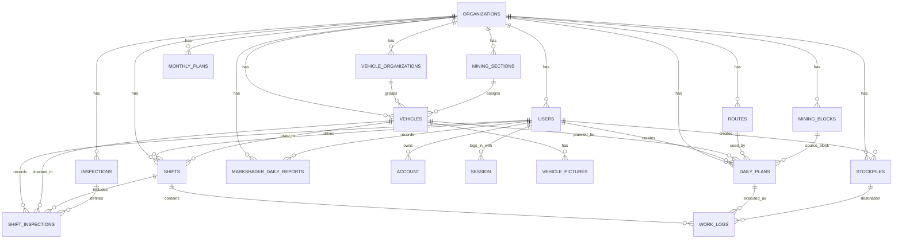

# Stratum ERP Database Relations

This document describes the main entity relationships in the current schema.

## Cardinality overview

### Organization-centered relations

- `organizations` 1:N `users`
- `organizations` 1:N `vehicles`
- `organizations` 1:N `vehicle_organizations`
- `organizations` 1:N `mining_sections`
- `organizations` 1:N `mining_blocks`
- `organizations` 1:N `stockpiles`
- `organizations` 1:N `routes`
- `organizations` 1:N `inspections`
- `organizations` 1:N `shifts`
- `organizations` 1:N `daily_plans`
- `organizations` 1:N `monthly_plans`
- `organizations` 1:N `markshader_daily_reports`

### User relations

- `users` N:1 `organizations`
- `users` 1:N `account`
- `users` 1:N `session`
- `users` 1:N `shifts` through `shifts.driver_id`
- `users` 1:N `shift_inspections` through `shift_inspections.driver_id`
- `users` 1:N `stockpiles` through `stockpiles.created_by`
- `users` 1:N `daily_plans` through `daily_plans.created_by`
- `users` 1:N `markshader_daily_reports` through `markshader_daily_reports.recorded_by`

### Vehicle relations

- `vehicles` N:1 `organizations`
- `vehicles` N:1 `vehicle_organizations`
- `vehicles` N:1 `mining_sections`
- `vehicles` 1:N `vehicle_pictures`
- `vehicles` 1:N `shifts`
- `vehicles` 1:N `shift_inspections`
- `vehicles` 1:N `daily_plans`

### Shift and execution relations

- `shifts` N:1 `users` as driver
- `shifts` N:1 `vehicles`
- `shifts` N:1 `organizations`
- `shifts` 1:N `shift_inspections`
- `shifts` 1:N `work_logs`

### Inspection relations

- `inspections` N:1 `organizations`
- `inspections` 1:N `shift_inspections`
- `shift_inspections` N:1 `shifts`
- `shift_inspections` N:1 `vehicles`
- `shift_inspections` N:1 `users`
- `shift_inspections` N:1 `inspections`

### Planning and production relations

- `routes` 1:N `daily_plans`
- `mining_blocks` 1:N `daily_plans` through `pick_up_block_id`
- `vehicles` 1:N `daily_plans`
- `daily_plans` 1:N `work_logs`
- `stockpiles` 1:N `work_logs`
- `work_logs` N:1 `shifts`
- `work_logs` N:1 `daily_plans`
- `work_logs` N:1 `stockpiles`

### Important modeling note

- `daily_plans.stockpile_ids` stores multiple stockpile references in a UUID array.
- This behaves like a many-to-many planning link, but it is not enforced with a junction table.
- If the system grows, replacing this with a table like `daily_plan_stockpiles` would make reporting and referential integrity stronger.

## ERD-style text view

```text
organizations
  |- users
  |   |- account
  |   `- session
  |- vehicle_organizations
  |- mining_sections
  |- vehicles
  |   `- vehicle_pictures
  |- mining_blocks
  |- stockpiles
  |- routes
  |- inspections
  |- shifts
  |   |- shift_inspections
  |   `- work_logs
  |- daily_plans
  |   `- work_logs
  |- monthly_plans
  `- markshader_daily_reports

vehicles ----< shifts ----< work_logs >---- stockpiles
    |             |
    |             `----< shift_inspections >---- inspections
    |
    `----< daily_plans >---- routes
                 |
                 `---- mining_blocks
```

## Mermaid ERD



## Recommended future relation improvements

- Add `daily_plan_stockpiles` to normalize the `stockpile_ids` array
- Add `vehicle_assignments` if equipment can be booked beyond a single shift model
- Add `maintenance_work_orders` linked to `vehicles`, `users`, and `parts`
- Add `fuel_transactions` linked to `vehicles`, `shifts`, and `stock_locations`
- Add `contractor_entities` and contract-linked operational records for mixed owned / rented fleet scenarios
